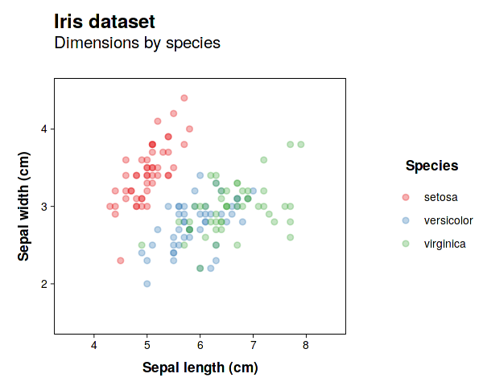
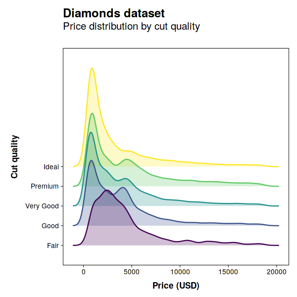
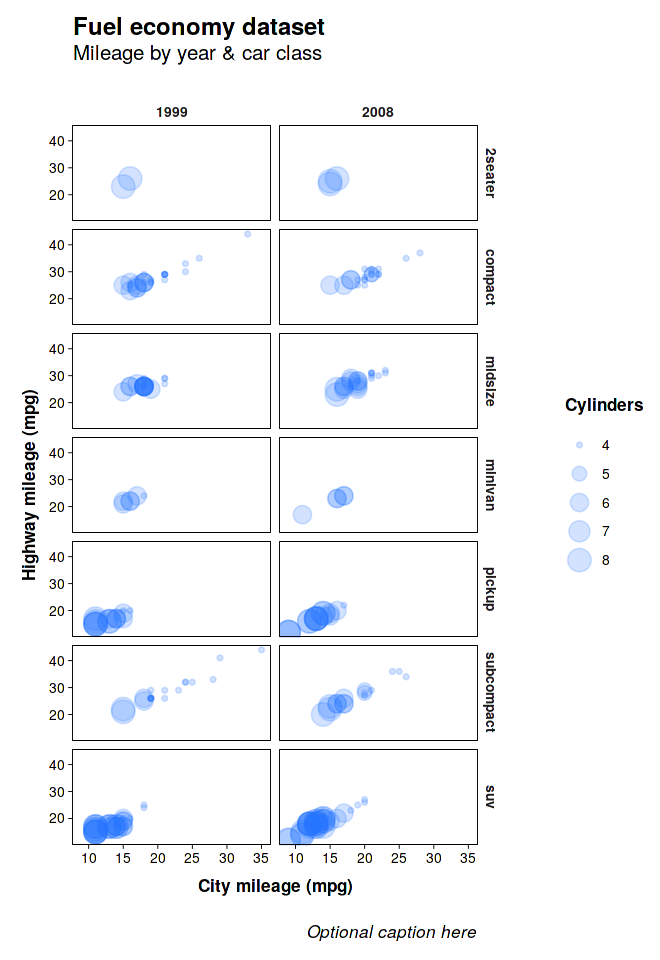

# "Less is more" theme for ggPlot2

This a minimalist theme for making simple and efficient plots in ggPlot2, aimed towards academic manuscripts.

## How to use
- Download the ```theme_lessismore.R``` file
- Using an R command line, import ggPlot2 : <br>
```import("ggplot2")```
- Import the ```theme_lessismore.R``` file : <br>
```source("INSERT FILE DIRECTORY HERE/theme_lessismore.R")```
- For testing, use the ```theme_lessismore()``` function. For example :
```R
ggplot(mpg, aes(x = cty, y = hwy)) +
  geom_point() +
  theme_lessismore()
 ```
 - In order to use as the default ggPlot2 theme for the current session, use the following command :
 ```R
 theme_set( theme_gray() + theme_lessismore() )
 ```
 - NB : This theme uses the _Helvetica_ font.
 
 ## Gallery
 <p align = "left">
  <br>
  <br>
 

  </p>
